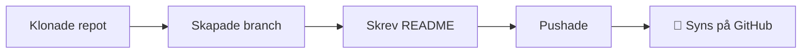

# 🧪 Readme Sandbox

> En lekplats där jag lär mig hur README-filer fungerar på GitHub.
> Inget här är på riktigt, så allt får gå sönder.

> [!TIP]
> Ny här? Hoppa direkt till [Ordlistan](#-ordlista) om du stöter på ett ord du inte känner igen.

---

## 🗺️ Min resa hittills

## ✅ Det jag har lärt mig

- [x] Klona ett repo
- [x] Skapa en branch
- [x] Pusha till GitHub
- [ ] Skapa en pull request
- [ ] Bygga ett quiz i C

## 📊 Markdown på 10 sekunder

| Du skriver | Du får |
|------------|--------|
| `**text**` | **fetstil** |
| `*text*` | *kursiv* |
| `~~text~~` | ~~överstruken~~ |
| `` `kod` `` | `kod` |

## 🧠 Testa dig själv

Vad gör <code>git push</code>?

Den skickar dina sparade ändringar (commits) från din dator upp till GitHub.

Varför ska man inte välja Download ZIP?

Då får du bara filerna, utan koppling till GitHub. Du kan inte pusha tillbaka.

## 📖 Ordlista

Klicka för att öppna

**Repo** – en mapp med kod och all dess historik.
**Branch** – en egen kopia där du kan ändra utan att påverka andra.
**Commit** – en sparad ögonblicksbild av dina ändringar.
**Push** – skicka dina commits upp till GitHub.

---

Skapad av Anton · Senast uppdaterad oktober 2026